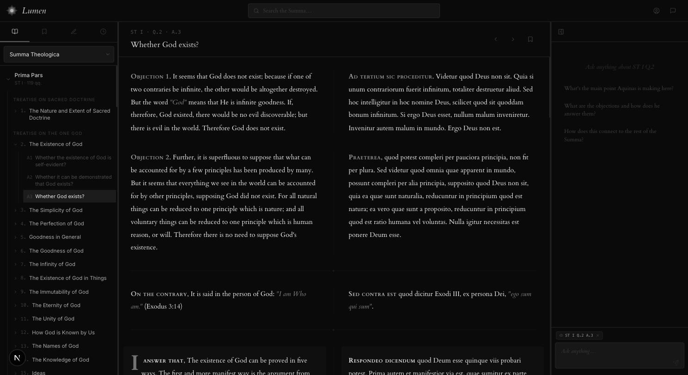

# Lumen

[](https://github.com/F0xhopper/Lumen/actions/workflows/ci.yml)

A study companion for the Summa Theologica. Full text in parallel English and Latin, hybrid semantic search, and an AI assistant grounded in the text, plus bookmarks, notes and reading history.



## Features

- **Full text:** all four parts and 512 questions, browsable by treatise, question and article, with a parallel English/Latin reading view. Article text is served as static JSON, so reading works without the backend.
- **Hybrid search:** dense embeddings (`text-embedding-3-large`) plus sparse BM25 in Pinecone, fused with Postgres full-text search via reciprocal rank fusion. HyDE query expansion and cross-encoder reranking (Pinecone-hosted, with a local fallback).
- **AI assistant:** a tool-calling agent that searches the Summa up to three times per question, answers with inline citations, streams its response, and knows which passage you are reading.
- **Study tools:** bookmarks with folders, per-article notes, reading history, font preferences and keyboard-driven navigation.
- **Accounts:** sign-in via Supabase (password, magic link or Google); bookmarks, history and preferences sync per user.

## Stack

| Layer | Technology |
| --- | --- |
| Frontend | Next.js 16 (App Router), React 19, TypeScript, Tailwind CSS, TanStack Query |
| Backend | FastAPI, asyncpg, Pydantic |
| Data | PostgreSQL (full text + user data), Pinecone (hybrid vector index) |
| Models | OpenAI GPT-4.1 (agent), gpt-4.1-mini (HyDE), text-embedding-3-large |
| Auth | Supabase |
| Hosting | Fly.io (API) |

## Running locally

### Frontend

```bash
cd frontend
npm install
npm run dev   # http://localhost:3000
```

Browsing the full text works immediately; no backend or keys required. Search and the AI assistant need the API below.

### Backend

```bash
cd backend
python -m venv .venv && source .venv/bin/activate
pip install -r requirements.txt
uvicorn app.main:app --reload --port 8000
```

Required environment variables (`backend/.env`):

```
DATABASE_URL=postgresql://...
OPENAI_API_KEY=sk-...
PINECONE_API_KEY=...
SUPABASE_URL=https://<project>.supabase.co
SUPABASE_ANON_KEY=...
```

The frontend also needs `NEXT_PUBLIC_SUPABASE_URL` and `NEXT_PUBLIC_SUPABASE_ANON_KEY` in `frontend/.env` for sign-in, and `BACKEND_URL` if the API is not on `localhost:8000`.

### Data pipeline

One-off scripts in `backend/scripts/` build the corpus: `import_summa` scrapes the English text into Postgres, `import_summa_latin` adds the Latin, `index_summa` embeds articles into Pinecone, and `export_articles_json` writes the static article JSON used by the frontend.

## Architecture

Monorepo: `frontend/` (Next.js) and `backend/` (FastAPI). The frontend proxies API calls through its own route handlers (`app/api/*`) to the backend, attaching the user's Supabase JWT. The backend is organised as domain modules (`articles`, `passages`, `query`, `bookmarks`, `history`, `preferences`), each with its own router, service and repository. Retrieval lives in `backend/app/services/` (hybrid search, HyDE, reranking) and the assistant's agent loop in `services/agent.py`.

CI runs the frontend build (which includes type checking) and Ruff on the backend. Pushes touching `backend/` also deploy to Fly.io.
